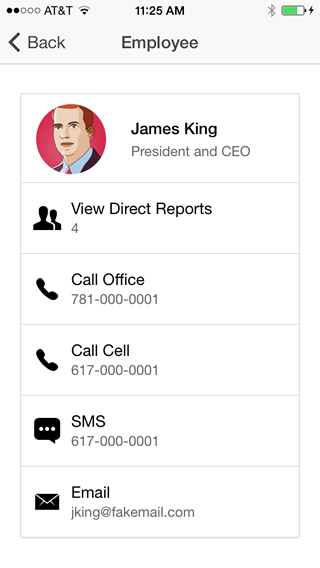

# Employee Directory with React and Node

[](https://travis-ci.org/DevOpsPlayground/directory-react-nodejs) [](https://codeclimate.com/github/DevOpsPlayground/directory-react-nodejs) [](https://codeclimate.com/github/DevOpsPlayground/directory-react-nodejs/coverage)

Employee directory is a sample application that allows you to look up employees by name, view the details of an employee,
call, text, or email an employee, and navigate up and down the org chart.

This version of Employee Directory is built with [React](http://facebook.github.io/react/) and [Node.js]().




## Running the application

1. Make sure you have [Vagrant](http://www.vagrantup.com) installed.
2. Install the [vagrant-gatling-rsync](https://github.com/smerrill/vagrant-gatling-rsync) and [vagrant-vbguest](https://github.com/dotless-de/vagrant-vbguest) plugins using the following command

   ```vagrant plugin install vagrant-gatling-rsync```

3. Install [Virtualbox](https://www.virtualbox.org/)
3. Clone this repository
4. On the command line, navigate (cd) to the **directory-react-nodejs** folder
5. Run the command ```vagrant up``. This will startup the VM and run the application in a docker container in the VM.
6. Open a browser and access: [http://localhost:5000](http://localhost:5000)
